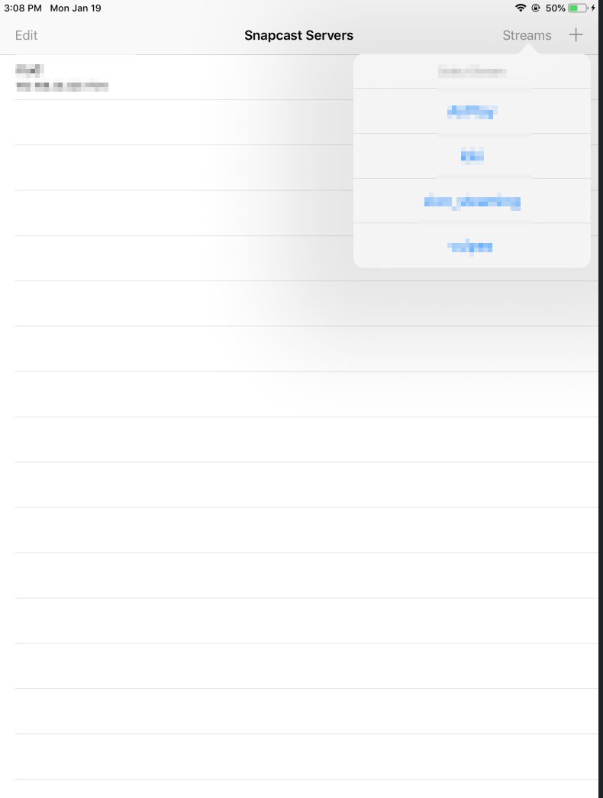

# SnapClientIOS
An iOS client for [Snapcast](https://github.com/badaix/snapcast), based on [SnapClientIOS](https://github.com/leejunkit/SnapClientIOS) by @leejunkit but heavily modified.

Rudimentary but basic functionality seems to be working well, synced with other clients, able to enter snapserver address and select desired audio stream.

## Timing Fix Notes (Current State)
At the start of this work the client played several seconds ahead of snapweb/other clients. The main root cause was incorrect parsing of SERVER_SETTINGS: the Snapstream payload is a 4-byte length-prefixed JSON blob, but the app attempted to decode the raw payload directly. That failed and left `bufferMs` at its default (1000ms), so playback was scheduled too early when the server buffer was larger (e.g., 3000ms).

Current behavior:
- SERVER_SETTINGS parsing supports length-prefixed JSON, so `bufferMs` and `latency` are populated correctly from the server.
- TIME sync uses payload latency when present (offset = (latencyMs - s2cMs) / 2) and RTT fallback otherwise.
- Quick-sync burst sends 50 TIME pings at 20ms, then switches to a 1s cadence.
- Scheduling cadence uses 40ms buffers; playback buffer is `serverBufferMs - clientLatencyMs` (per-client latency set from snapweb is honored).
- Output DAC time estimate uses the player timeline + output latency + 15ms offset (IO buffer duration is measured but not applied).
- Rationale: including IO buffer duration biased the estimate later and made this client consistently lag other snapclients; the queued audio timeline already accounts for buffering and snapclient CoreAudio does not add IO buffer duration there.
- AVAudioSession is configured with the stream sample rate and a 40ms preferred IO buffer duration; actual session values are logged at startup.

Status:
- Timing is improved vs the initial drift, but continued A/B testing against snapweb/snapclient is recommended when making buffer/latency changes.

Possible future refinements (if timing or stability regresses):
- Expose a configurable local `playerLatencyMs` (snapclient `settings.player.latency`) and decide whether it affects playback buffer math or only DAC estimation.
- Revisit DAC estimate constants (e.g., the +15ms guard) and add light smoothing/clamping if crackle returns.
- Keep evaluating buffer cadence vs stability; consider moving back to 80ms if 40ms proves too brittle.
- Add targeted logging for `outputBufferDacTimeMs`, `ageMs`, and correction decisions to help track drift.
